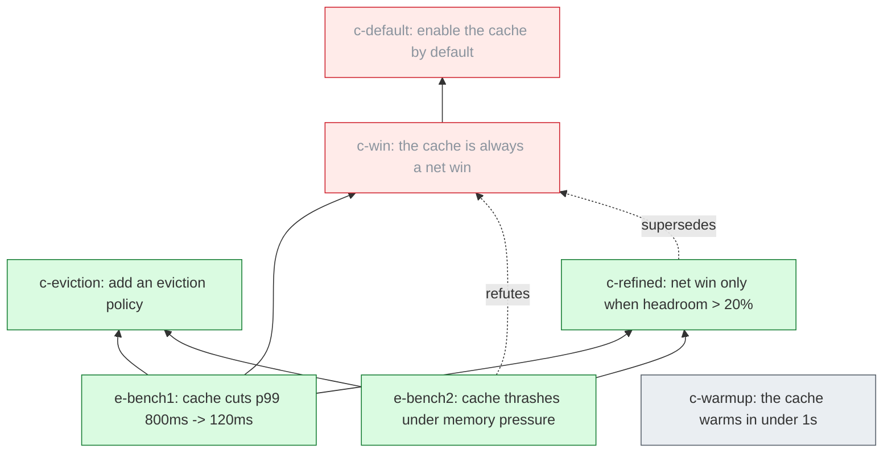

# adef

**A defeasible experiment notebook.** Record empirical conclusions as immutable notes in a
justification graph. When a later experiment refutes a prior conclusion, that note flips to
**no-go** and the change propagates (JTMS-style) through everything that depended on it — the
defeated subtree stays as the negative record, never edited away.

A [Claude skill](https://code.claude.com/docs/en/skills) (this repo root *is* the skill).
Sibling of the ADR pattern:

- **ADR** = *why I decided X* — design, permanent.
- **adef** = *what I concluded from experiment X* — empirical, **defeasible**.

## The name

**adef** = **a**gent + **def**easible — it joins the `a*` family (aide, amem, apay). A
*defeasible* conclusion is one that can be **defeated** — withdrawn when later evidence goes
against it (from *defeasible reasoning* / *defeasible logic*). That is exactly what a note here
is: its go/no-go standing is provisional and updates automatically as experiments arrive.

## What it looks like

Worked example ([`examples/cache-study/`](examples/cache-study)) — does a cache help? An early
benchmark says yes (`c-win` → go). A later benchmark shows it thrashes under memory pressure,
which **refutes** `c-win` and **cascades** to `c-default` (which only existed because the cache
was "always a win"). `c-refined` supersedes the too-strong claim; `c-warmup` has no experiment
yet, so it stays **open**.



Green = go, red = no-go (refuted / superseded / cascaded), grey = open. Solid = justifies,
dashed = refutes, dotted = supersedes.

## Install

adef is a [Claude Code skill](https://code.claude.com/docs/en/skills) — a capability Claude
loads and uses when it's relevant. It isn't on a marketplace yet; to try it now, clone the repo
straight into your skills directory. The repo root *is* the skill, so the folder **must** be
named `adef` (it has to match the `name` in `SKILL.md`):

```bash
# personal — available across all your projects:
git clone https://github.com/yiidtw/adef-skill.git ~/.claude/skills/adef

# or per-project — checked into a repo and shared with your team:
git clone https://github.com/yiidtw/adef-skill.git .claude/skills/adef
```

Claude Code picks it up live (no restart). Invoke it with `/adef`, or it triggers on its own
while you keep an experiment log. The engine needs **Python 3** (no other dependencies).

A `.claude-plugin/plugin.json` + a marketplace entry (for `/plugin install`) will follow once
it's had more real use.

## Quickstart

```bash
# add a note (auto-names the file YYYYMMDD_HHMMSS_<slug>.md)
python scripts/adef.py new experiment "cache cuts p99 800ms -> 120ms" --dir notes
python scripts/adef.py new claim "the cache is a net win" --justified-by e-bench1 --dir notes

# recompute go/no-go — writes status back, lists what flipped + its downstream
python scripts/adef.py notes

# what would fall if a result were refuted?
python scripts/adef.py notes --impact e-bench1

# visualize
python scripts/adef.py graph notes | dot -Tsvg > graph.svg   # GraphViz
python scripts/adef.py graph notes --mermaid                 # Mermaid (renders on GitHub)
```

## How it works

- Notes are immutable markdown + frontmatter (`id`, `kind`, `justified_by`, `refuted_by`,
  `supersedes`); `status` is **derived**, never hand-set. Cite by short `id`, not the filename.
- A claim is **go** iff every `justified_by` is go and no `refuted_by` is go. The moment a
  justification collapses or a refuter goes live it flips to **no-go** and its dependents are
  re-checked. Overturn by adding a note that `supersedes` — never edit the old one.
- Engine: [`scripts/adef.py`](scripts/adef.py) — pure JTMS DAG propagation, no deps.

## More

- Thesis, prior-art map, ownable boundary: [`docs/design/0001-scope.md`](docs/design/0001-scope.md)
- Note format: [`docs/design/TEMPLATE.md`](docs/design/TEMPLATE.md)

## References — what we built on

adef is an **assembly** of well-established ideas, not a new mechanism. The pieces:

- **Truth Maintenance Systems** — Jon Doyle, *A Truth Maintenance System* (JTMS, 1979); Johan
  de Kleer, *An Assumption-based TMS* (ATMS, 1986). Retract-and-propagate: withdraw a premise,
  dependent beliefs flip and the change cascades. adef's go/no-go is a DAG-restricted JTMS.
- **Belief revision (AGM)** — Alchourrón, Gärdenfors & Makinson (1985). The theory TMS operationalizes.
- **Architecture Decision Records** — Michael Nygard (2011). The immutable "record with the why,
  overturn by superseding" note shape.
- **IBIS** — Rittel & Kunz (1970); Conklin & Begeman, *gIBIS* (1988). The argumentation graph
  (issue / position / for-and-against) that ADRs descend from.
- **Nanopublications** — Groth, Gibson & Velterop (2010). Immutable claim + provenance, retracted
  or superseded rather than edited — the model for scientific-claim notes.
- **Electronic lab notebooks** — e.g. [eLabFTW](https://www.elabftw.net/). Immutable, versioned
  notebooks — which, notably, do *not* propagate belief; that is adef's addition.
- **Architectural decision graphs** — Kruchten, *An Ontology of Architectural Design Decisions*
  (2004); Zimmermann et al., decision models with dependency relations + production rules (2009).
  Typed decision-dependency graphs with propagation — the graph half, done 20 years ago.
- **DMN** (OMG, 2015) — decisions-as-a-graph, standardized (for operational decisions).
- **Stage-Gate** — Robert Cooper (1980s). The go / no-go / kill vocabulary.

The one thing adef owns is the **combination** — a lab notebook where an experiment flips a
prior conclusion's go/no-go and propagates through the dependency graph, keeping the refuted
subtree navigable. The claim is *architectural*, not novel. See
[`docs/design/0001-scope.md`](docs/design/0001-scope.md) §4.
